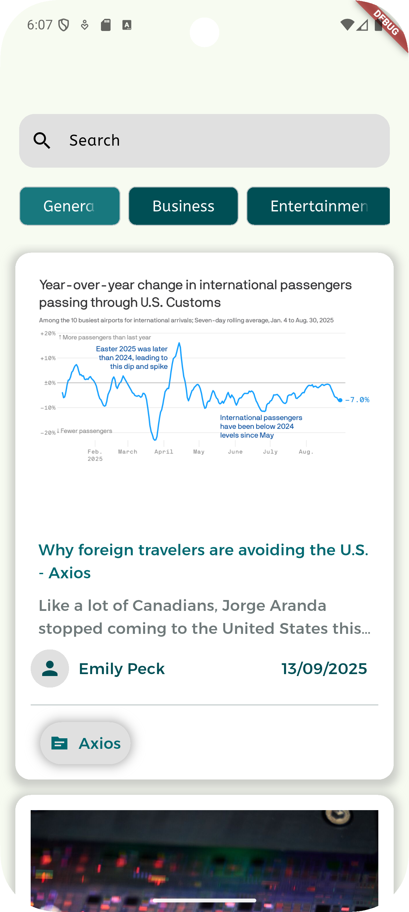
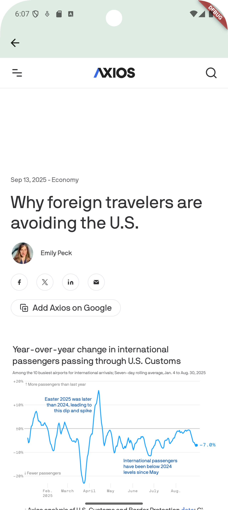
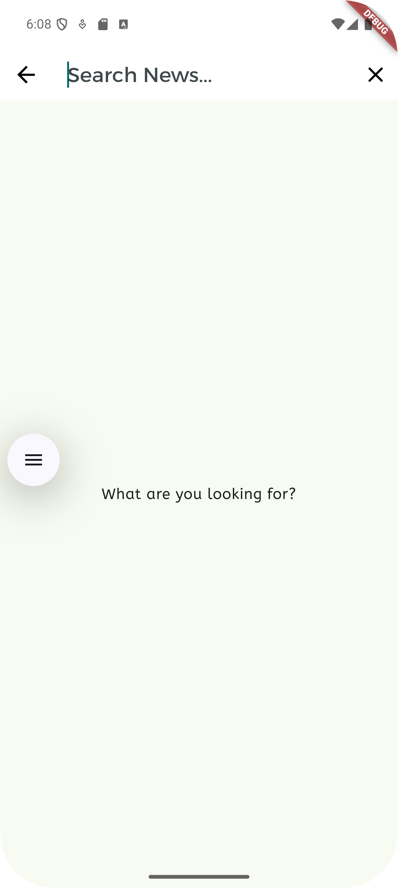

# 📰 DevProjects - News Mobile App  

This is an open source project from [DevProjects](http://www.codementor.io/projects). Feedback and questions are welcome!  
🔗 Project requirements: [News mobile app](https://www.codementor.io/projects/mobile/news-mobile-app-atx32p8oq5)  

---

## 📖 Description  
This project is a Flutter app that displays a list of news articles fetched from the **News API**. The goal is to present the latest news in a clean and immersive UI without taking the user outside of the app.  

---

## 🚀 Features  
- **News List:** Displays a list of the latest news articles.  
- **Details Shown:**  
  - Source (e.g., TechCrunch)  
  - Author (e.g., Mark Johnson)  
  - Title of the article  
  - Subtitle (truncated to 2 lines)  
  - Published date in `MM/DD/YYYY` format  
  - Thumbnail image from the API  
- **Article Details:** Tapping an article opens a new in-app webview to read the full content.  
- **Search News:** Search articles by keywords using Flutter’s built-in `SearchDelegate`, fetching data dynamically from the News API.
- **Pull-to-Refresh:** Refresh the news list with a simple swipe-down gesture.
- **Pagination:** Load more articles as the user scrolls, ensuring smooth performance.
- **Category Filter Chips:** Users can filter news by categories (e.g., Business, Technology, Sports) by selecting from filter chips on the home screen.
- **Secure API Key Storage (Extra):** The API key is stored securely to avoid exposure in public repositories.  
- **Clean UI:** Simple, responsive, and user-friendly interface.  

---

## 📸 Screenshots & Demo  





---

## 🛠️ Tech Stack  
Built with **Flutter** (Dart).  

**Key Packages**:  
- **Dio:** For making HTTP requests.  
- **Riverpod:** State management for scalable app logic.  
- **webview_flutter:** To display news articles inside the app.  
- **intl:** For formatting published dates.  
- **connectivity_plus:** To check for internet connectivity.  
- **flutter_secure_storage:** To store the News API key securely.  

---

## 📂 Project Structure  
```
lib/
│
├── core/
│   ├── extensions/
│   │   ├── sized_box.dart
│   │   └── string.dart
│   ├── network/
│   │   ├── api_exceptions.dart
│   │   ├── dio_client.dart
│   │   └── services/
│   │       └── secure_storage_service.dart
│   ├── theme/
│   │   └── theme.dart
│   ├── util.dart
│   └── utils/
│       └── constants.dart
│
├── features/
│   ├── home/
│   │   ├── data/
│   │   │   ├── top_headline_repository.dart
│   │   │   ├── top_headline_service.dart
│   │   │   └── model/
│   │   │       └── top_heading_model.dart
│   │   ├── presentation/
│   │   │   ├── home_page.dart
│   │   │   ├── news_body.dart
│   │   │   └── news_search_delegates.dart
│   │   └── providers/
│   │       ├── news_notifier.dart
│   │       └── news_provider.dart
│   │
│   └── news_details/
│       └── presentation/
│           └── news_details_page.dart
│
├── widgets/
│   ├── article_image.dart
│   ├── author_date_row.dart
│   └── source_row.dart
│
└── main.dart
```
---

## 🟦 Requirements Checklist  
* [x] Show list of news articles with:  
  * [x] Source  
  * [x] Author  
  * [x] Title  
  * [x] Subtitle (2 lines, truncated)  
  * [x] Published date (MM/DD/YYYY)  
  * [x] Image thumbnail  
* [x] On tap, open article in-app (WebView).  
* [x] Search functionality with `SearchDelegate` and News API integration.
* [x] Pull-to-Refresh support on the news list.
* [x] Pagination (infinite scrolling) for smoother browsing.
* [x] Category filter chips to select news categories.  
* [x] (Extra) Securely store the API key using `flutter_secure_storage`.  

---

## ⚙️ Installation & Setup  

### Prerequisites  
- **Flutter SDK** installed → [Install guide](https://flutter.dev/docs/get-started/install)  
- **Dart SDK** (bundled with Flutter)  
- **IDE**: Android Studio / VS Code with Flutter plugin  

### Steps to Run  
1. Clone the repository:  
```
   git clone https://github.com/your-username/news-mobile-app.git
```

2.  **Navigate to the project directory:**
    Change your current directory to the project folder:
```
cd news_mobile_app
```    

3.  **Run the application:**
    Use the Flutter command to run the application:

```
flutter pub get
flutter run    
```
---
## 📖 Usage 
1. Launch the app
2. The home screen displays news articles with details.

3. Tap an article to read it inside the app.
---
## 🔐 API Key Security

To avoid exposing the API key:

Use flutter_secure_storage to save the key locally.

Exclude sensitive files (like .env or secrets.dart) using .gitignore.

Example .gitignore addition:
# API Keys and Secrets
```
.env
```

## 🤝Contributing

### Contributions are welcome! 🎉

1. Fork the repository
2. Create a new branch → `(git checkout -b feature-branch)`
3. Commit changes → `git commit -m "Add feature XYZ"`
4. Push changes → `git push origin feature-branch`
5. Open a Pull Request.